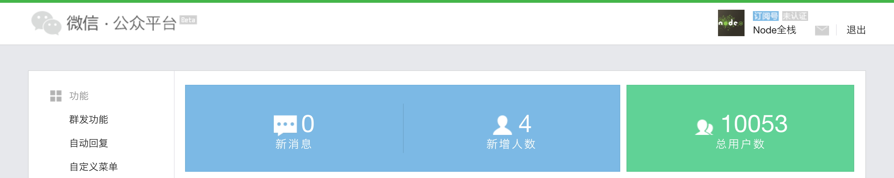
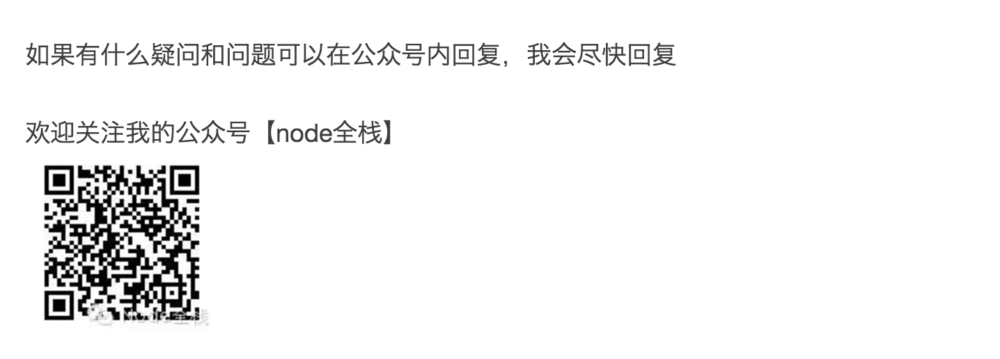
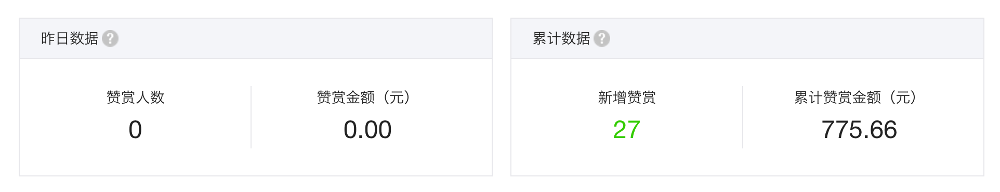

# 【Node全栈】升级为cnode官方公众号，招收喜欢运营的小伙伴

目前【Node全栈】公众号的粉丝数已破万，对我来说也算完成了一个阶段性的目标吧，做个简单的总结。

最初，只是想学学运营，公司里专门运营的人不想碰，那就我来吧，CTO就是一块砖，哪里需要哪里搬。我的初衷很简单，我想挑战一下运营，除了编程外，我相信其他的我也一样能够做好。

- 注册了公众号
- 从以前的文库里，找到《生活如何不无聊》，发了第一篇文章
- 将给小弟培训的ppt改改，发了第二篇文章《Nodejs入门教程ppt分享》

后来就坚持着写，各种小弟们需要了解的实战，大部分都是实践经验，所以在cnode上被alsotang加了很多精华。这本身对我来说也是一种提高，虽然粉丝数寥寥无几，但是还是有效果的。直接推广肯定是大家不喜欢的，于是我在精华帖子下面都加了公众号的二维码

这招是非常有效的，对于传播来说是非常常见的手段，如果大家自己观察好的公众号文章都会明白的。我的经验也是这样来的。

在天津是非常难于招人的，尤其是在空港那个位置，对我而言更是苦不堪言，带去的小弟不愿意呆，本地的又找不上人，那么长此下去就是一个死局。对于一个CTO来说，如果连人都找不到，那就是失职。

很明显，大家都喜欢跟着大牛一起干，哪怕是学徒都愿意的，这个观点是正确的，能够屈尊这样做的人，也是有抱负的人，我个人是非常看好的。社区里有很多散落的有基础的人，只要稍加培养，就可以变成非常得力的帮手。

但酒香还怕巷子深啊，于是，我就把注意力转移到公众号上，利用粉丝效应，为自己招人。以前我可以睡到8点，可是为了写公众号文章，我就必须7点起来，趴在床上写文章，最好是赶在大家在路上的时候能够看到，这样打开率会高一些。

> 那是一段很苦，但很快乐的日子

我坚持了很久，粉丝数也明显的上升，突破1千，2千。。。内心还是很激动的。我觉得我对自己的挑战算是成功的，以一个程序员的水平将运营做到这种地步，也还算可圈可点了吧。

其实光有文章和公众号是不够的，粉丝是要聚集的，你要能够和他们活动才有价值。这也非常符合我招人的初衷。于是成了Node全栈的群，很多朋友都是在这里聊起来的。慢慢的，你会发现，除了互动外，对于文章的打开率也是非常有好处的。发了篇公众号，然后转到群里了，大家讨论讨论也还是很愉快的事儿。

招人效果也是不错的，慢慢的有人开始找我，咨询是否需要招人，当我告诉他们在天津的时候，大部分人都只能观望了。我是能够理解他们的，离开舒适区是多么难得事儿。但是对我而言，至少有人知道我在招人，这无疑也是一种成就。像德龙、祖宽、文能等好兄弟，都是因此相识的。

但影响力就这么大，社区就这么大，又是一个极其专业的领域，想要做的更大是很难的事儿，这也是我遇到的瓶颈。通过精华帖以及信任，alsotang给了我cnode的管理员权限，我大学的时候就对社区非常了解，所以一切也算轻车熟路。那么，下一步该怎么做呢？我也是很迷茫的

由于一直欠薪创业，再加上结婚等，我连吃饭的钱都快没有了，媳妇在老家，我又不好意思张口要，真是很难受的省吃俭用，后来没办法，我就发起了一次培训[《高效编码习惯训练班（vsc为主，含Nodejs调试技巧）》](https://cnodejs.org/topic/5636b5558c67728402553335)
当时招上来10个人，算是解了我的燃眉之急。这就是后来我在github上的vsc文档的基础，目前也超过200多个star了。我也算是vscode在国内推广比较早的人吧，对这个趋势还是判断的比较准的。

后来StuQ就找到了我，做了几次技术分享，比如《Node.js最新技术栈之Promise》，《Gulp实战和原理解析》等，StuQ做的推广，我也利用公众号做了推广，由于这几篇文章内容还不错，所以大家的口碑也不错，觉得简单易懂，各种好评也都到了StuQ那边。

后来就合作了《Node.js微信开发》课程，我发现这其实也是个不错的招人方式，想学习的人，培训完了，也可以招到公司来嘛。我还是本着我做的做事原则，做啥都尽力做，不要给自己留下遗憾，准备这个课件也是挺费力的事儿。白天忙工作，晚上把一部分经验整理出来，形成后来的课件。每次都是在讲课前还在修改文档，讲的时候还会现场发挥，所以很多时候都超过1小时。好在大家还都比较喜欢听。写的东西和讲的东西是不一样的，我也从中获益良多。

对我而言，产出更好的原创内容，才能有更多粉丝。精华帖和教程都很重要。最重要的是要有原创的干货。后来博文视点的编辑主动找我，签下了2本书约和一本翻译。公司的框架，开源了，也就是moajs的前身。各种总结的文档也都在cnode上是精华帖，偶尔会去oschina上的博客上蹭个头条，粉丝数平稳的的增长，线上基本也就这样了。

于是我把目标转移到了线下，参加了海良组织的几次北京的NodeParty，分享一些内容，解答一些大家的疑问。兄弟们人都非常好，也非常给面子，小圈子也是社交，我也很喜欢在演讲时的心惊肉跳，都是经验嘛。我以前带过很大团队，给他们分享和在外面分享是不一样。陌生而刺激。以前跟很多人一样，想了很多上台就没话了。可是工作都快10年了，有了足够多的积累，可以讲的想讲的话也就多了，也算是厚积薄发的一个过程吧。

演讲的内容也是非常好的公众号材料啊，偶尔曝光个活动，大家的互动也会相应增加的。慢慢的我也就多参与一些活动，像live.nodejs.org、ningjs、野狗，开源年会这样的活动，增加个人影响力是对公众号的非常的手段，常见逻辑，因为喜欢你这个人，才会关注你的公众号。我算是一个工作狂吧，有时胡子都不刮就直接上去讲，大家都觉得像金刚狼，于是就有狼叔这个雅号。我本来是不喜欢的，可是换个角度，能够让大家娱乐，也未尝不是一件好事吗？后来在公众号里加入了不少娱乐的成分，我一直觉得，干什么都要能够玩出乐趣，如果没乐趣还不如不做。对于公众号也是，别人看你的公众号只有干货，早晚会噎死的。要让人觉得舒服，要让愿意看，这是挺难的事儿。我并不擅长搞笑，素有行走的冰箱之称。我只能自己安慰自己说尽力就好。

所有这些，其实就是在公众号提供素材，于是题材也变得宽泛了很多

- 原创文章《浅出Promise与Api封装》《【Node.js Koa源码解析】co@4.6版本源码解析》
- 转载cnode好的文章活动《【社区精选】7 天 600 stars， Mobi.css 是如何诞生的》、《用Node.js的CTO是写代码的，想看看他的经历么？》、《【推荐活动】Nodejs区块链开发作者imfly邀您茶话》
- 答疑类的《为啥Koa 2.x要多出个ctx？》
- 点评或者正名之类的文章，比如《个人讣告，与Node何干？为莫名躺枪的Node.js正名》
- 新闻《GitHub发布2016年开源报告》、《Node.js 7.0安装体验和示例代码解读》
- 个人动态《最近的2场分享》、《前一阵做的3个分享》《昨天狼叔直播的微信小程序讲义，据说效果不错哦》《狼叔的jsconf 2016总结：Moa 2开源》《6-18 野狗Meetup技术沙龙，他们都来了！》
- 娱乐的[《年度最期待大片，《狼叔前传》首部预告片》](http://mp.weixin.qq.com/s?__biz=MzAxMTU0NTc4Nw==&tempkey=JSd6eLNNty57%2BJV%2F%2BLdIll6q%2Ft0DDWazkDY0HBArqGitcN6CTbD15Dt%2BybqZl9E8JGHTzxiuGYngcZy8KWwMX8QcN0tH8qA8Ow7jsozfePSI9W3yZW8Ez9LsTgqQV03JmN8gTPifu2X%2FGs01AYWdpQ%3D%3D&#rd)，《【脑洞大开笑死你】之：什么狗不掉毛？》、《1024节日快乐！嗨起来~》
- 蹭热点《未来是h5的：写在微信应用号发布之际》
- 组织一些活动《今晚直播聊聊Koa（7月4日 周一晚9点 ）》

总体来说，做的不那么精细，只有我一个人在维护，我并没有太多时间，我还要写代码，当一个被坑的cto，公众号运营做的不是很好。感谢大家的包容和忍受。

因为和公司股权的问题，我从有股份变成了1万元每月的打工者，也是醉醉的，合同又让我弄丢了，官司也没法打，我能说的是大家一定要好好保存合同。**感谢各位兄弟的信任，天津的公司不会再招人了，我也不会跟无耻的人有任何关系**。我的书也没有写完，对不住春雨编辑，我的课程也天天被海角催，辛苦你们了。但生活还得继续，我还要工作，不能在公众号上花费太多时间。我希望大家都说“狼叔是个架构师”，而不是自媒体，骨子里我还是做技术的程序员，偶尔还懂点运营。

我也深知，运营一个公众号打单独斗是不够，是需要有团队配合的。

在此，Node全栈公众号粉丝破万之际，我也已经完成了我个人的初衷。我想把Node全栈公众号捐给cnode社区，以社区的名义一起来维护。公众号很早就有了原创打赏功能，破万之后有了流量主即广告收入，虽然没多少钱，也一并捐给社区。

立2个规矩：

- 公众号所发文章必须是cnode上的文章
- 对cnode社区发展有利

由于无法直接修改账号本体，我把打赏的数目发出来，作为基数，以后增加的所有收入会捐给社区，所有的商务合作，请联系alsotang@gmail.com

同时，如果你也感兴趣运营，想和我一起运营好cnode社区的微信公众号，如果你也认为为社区服务也是很快的一件事儿，可以加我一起聊聊，除了技术、评论、搞笑外，我希望我们还是好朋友，我也会尽我所能给你提供各种支持。

加入我们，你将获得

-  积累社区经验、威望
- 提升运营水平，虽然粉丝不是特别多，但也不算太少了，是个不错的起点
- 和cnode大牛、管理员们近距离接触
- 更有被内推bat的机会

赶快报名吧，在本帖回复，或在【Node全栈】公众号里回复“运营”，都可以